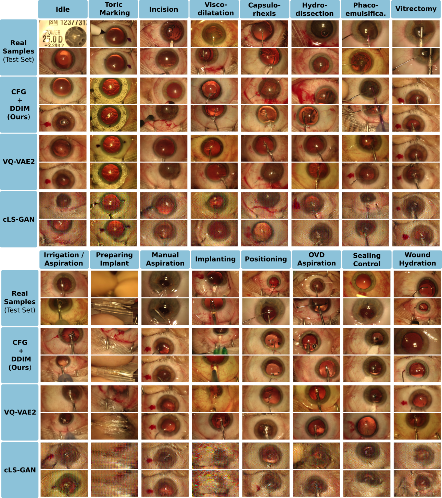

# Synthesizing Rare Cataract Surgery Samples with Guided Diffusion Models

This is the official code repository for *Synthesizing Rare Cataract Surgery Samples with Guided Diffusion Models*.


## Setup
* Install an environment (venv/conda) with Python >= 3.9
* Install the package requirements with ```pip install -r requirements.txt```
* Install the source code package with ```pip install -e .```

## Usage

The ```run_train/``` folder contains individual training scripts for each method and dataset used in the paper.
Every script can be used with CLI arguments as
```
python train_XXX_YYY.py --data_path ... 
                        --config ... 
                        --log_dir ... 
                        --device_list ...
```

Model checkpoints and configuration files to reproduce our results can be found [here](https://drive.google.com/drive/folders/1w-WSwbHDmg-ltMaoiKuPTYBGrWJOZqcw?usp=sharing).

The ```run_eval/``` folder contains the evaluation scripts needed to reproduce the results displayed in the paper.

The ```run_tests/``` folder contains scripts and notebooks to test different functionalities of this repository.

## Data

The CATARACTS challenge data is available [here](https://cataracts.grand-challenge.org/).

## Example Results



## Downstream Task Improvements

We empirically demonstrate how synthetic samples can be used to improve downstream task performance - such as surgical tool-set classification.
Using an additional 30.000 synthesized CATARACTS samples, we are able to improve classification performance by up to 10% for underperforming phases.


## Image Quality Assessment Study

To evaluate the quality of our generated images, we designed a user study which we conducted with six clinical experts, split into non-domain experts (NDE) and domain experts (DE) for cataract surgery. The user study results show that the samples generated by our model become almost indistinguishable from real images.

| Clinician | NDE1 | NDE2 | NDE3 | DE1 | DE2 | DE3 |
|-----------|------|------|------|-----|-----|-----|
| MCC       | -0.961| -0.288 | -0.201 | -0.233 | 0.098 | 0.288 |
| FR        | 49/50 | 32/50 | 30/50 | 31/50 | 23/50 | 18/50 |

The user study template and results can be found in ```user_study/```.

## How-to Cite

If you use our research or the resources within this repository,
please consider citing our work. Below is the recommended citation:

### APA (American Psychological Association) Style:

```swift
Frisch, Y., Fuchs, M., Sanner, A., Ucar, F. A., Frenzel, M., Wasielica-Poslednik, J., ... & Mukhopadhyay, A. (2023).
Synthesising Rare Cataract Surgery Samples with Guided Diffusion Models. arXiv preprint arXiv:2308.02587.
```

### BibTeX (for LaTeX users):

```bibtex
@article{frisch2023synthesising,
  title={Synthesising Rare Cataract Surgery Samples with Guided Diffusion Models},
  author={Frisch, Yannik and Fuchs, Moritz and Sanner, Antoine and Ucar, Felix Anton and Frenzel, Marius and Wasielica-Poslednik, Joana and Gericke, Adrian and Wagner, Felix Mathias and Dratsch, Thomas and Mukhopadhyay, Anirban},
  journal={arXiv preprint arXiv:2308.02587},
  year={2023}
}
```

## TODOs

* [ ] Add explanation of pre-processed dataset structure 
* [ ] Add warm-start functionalities
* [ ] Use WrappedModel in every training and evaluation script
* [ ] Add live demo
